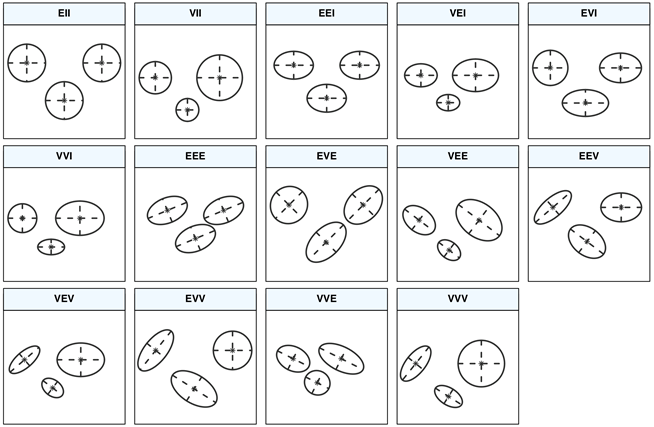

```{r setup, include=FALSE}
knitr::opts_chunk$set(echo = TRUE)
```

```
 ██████╗ ███╗   ███╗███╗   ███╗
██╔════╝ ████╗ ████║████╗ ████║
██║  ███╗██╔████╔██║██╔████╔██║
██║   ██║██║╚██╔╝██║██║╚██╔╝██║
╚██████╔╝██║ ╚═╝ ██║██║ ╚═╝ ██║
 ╚═════╝ ╚═╝     ╚═╝╚═╝     ╚═╝
```

# Status

NOT DONE SO PLEASE PROCEED WITH CAUTION

## Table of Contents

* Model Description
* Data set exploration
* Evaluating the optimum number of clusters
* Cluster analysis

## Model Description

A method used for clustering. It assumes that data comes from a distribution that is a combination of several Gaussian distributions.

### Soft Clustering

The clusters in the GMM overlap with each other. The GMM provides what is called a “soft” or probabilistic clustering. Each point does not strictly belong to a single cluster,but instead has a degree or probability of membership in each cluster. In this particular clustering, we can think that a point is more likely to have come from some clusters than others. However, there still is a possibility, perhaps remote, that the point may have come from any of them.

### A Probability-Based Clustering

*To be done*

### The EM Algorithm

The problem is that we know neither of these things: not the distribution that each training instance came from nor the five mixture model parameters. So we adopt the procedure used for the k-means clustering algorithm and iterate. Start with initial guesses for the five parameters, use them to calculate the cluster probabilities for each instance, use these probabilities to reestimate the parameters, and repeat. (If you prefer, you can start with guesses for the classes of the instances instead.) This is called the EM algorithm, for expectation maximization. The first step—calculation of the cluster probabilities, which are the “expected” class values—is “expectation”; the second, calculation of the distribution parameters, is “maximization” of the likelihood of the distributions given the data available.


## Required Packages

```{r}
library(mclust)
library(factoextra)
library(cluster)
library(plotly)
library(dplyr)
```

## Dataset Preparation

```{r}
data <- iris
summary(data)

```

### Normilize the data

```{r}
scaled_data <- scale(data[,c(-5)])
```


## GMM Aplication

```{r}
# List of clusters to be analysed
test_clusters <- 1:10

# Training the model
model <- Mclust(scaled_data, G=test_clusters)
```


## BIC and AIC metrics

How to select K? 

- If we choose K to maximize likelihood, when K increases the value of the maximum likelihood cannot decrease. Thus more complex models will always improve likelihood.

- It is necessary to penalize the complexity of the model. We need a balance between how well the model fits and the data and the simplicity of the model 

This is where we choose K based on the score returned either by Akaike information criterion (AIC) or Bayesian information criterion (BIC)

* AIC Score:

* Bayesian Information Criterion BIC

When comparing models fitted by maximum likelihood to the same data, the smaller the AIC or BIC, the better the fit.

```{r}
AICscores <- c()
BICscores <- c()
for (k in test_clusters) {
  kmodel <- Mclust(scaled_data, G=k)
  AICscores <- append(AICscores, AIC(kmodel, k=2))
  BICscores <- append(BICscores, BIC(kmodel))
}
```

Then we plot the result that each algorithm gave us

```{r}
## AIC adn BIC scores comparission 
plot(1:length(AICscores), AICscores, 
     type = "o", 
     main= "Akaike Information Criterion (AIC) Score",
     xlab = "Number of components",
     ylab = "AIC Scores",
     xaxt='n')
axis(side=1, at=1:length(AICscores), labels=1:length(AICscores),cex.axis=0.8)

plot(1:length(BICscores), BICscores, 
     type = "o", 
     main= "Bayesian Information Criterion (BIC) Score",
     xlab = "Number of components",
     ylab = "BIC Scores",
     xaxt='n')
axis(side=1, at=1:length(BICscores), labels=1:length(BICscores),cex.axis=0.8)

```

Mclust function also returns whish form of the clsuter better fit the gaussian density of the data, not only returning his own BIC score results but also the better fitted form.

Here is an image for reference




When comparing models fitted by maximum likelihood to the same data, the smaller the AIC or BIC, the better the fit.

After this we can conclude that <insert number> clusters represent the best
the groups shown in the iris data set

```{r}
opt_model <- Mclust(scaled_data, G=2)
opt_model$density <- densityMclust(scaled_data, G=2)$density
plot(opt_model)
```

Option 2 gives the actual cluster formed

Option 3 gives rows that the algorithm couldn't associate with either cluster

Option 4 gives the density of each clsuter

### 3d Visualization of the clusters

We already seen how the groups would look in a 2d plane, but not always the data set will behave as this one, it can happen sometimes that the clusters intersect each others and makes it difficult to differentiate both. One way to distinguish better each cluster is plotting the in a 3d space, being the height Value the density of each coordinate in the data. Next we will use the plotly library, which I like personally for its flexibility and features.

```{r}
plot_ly(x=scaled_data[,2], 
        y=scaled_data[,3], 
        z=opt_model$density, 
        color = opt_model$classification, 
        colors = c("#FF0000", "#0000FF"),
        mode = "markers", 
        type = "scatter3d", 
        opacity= 0.5) %>% hide_colorbar()

```

## Evaluation

We saw that by using the AIC and BIC metrics we could decided which would have been the best number of cluster to better fit our data. Sadly we are not done yet, we did find the the best number of cluster but we don't know yet if those groups really represent the behavior of the data

```{r}
#Searching for K based on silhouette
coefSil=c()
for (k in test_clusters[-1]){
  model = Mclust(iris[1:4], G=k)
  temp = silhouette(model$classification,dist(iris[,1:4]))
  coefSil[k]=mean(temp[,3])
}

tempDF=data.frame(CS=coefSil,K=test_clusters)

ggplot(tempDF)+
  aes(x=K,y=CS)+
  geom_line()+
  scale_x_continuous(breaks=test_clusters)+
  xlab("N. of Clusters")+
  ylab("Silhouette Coefficient")+
  ggtitle("Silhouette Coefficient vs N. of Clusters")
```


```{r}
#Silohouette coefficient
model = Mclust(iris[1:4], G=2)
cluster=model$classification
coefSil=silhouette(cluster,dist(iris[,1:4]))
summary(coefSil)
fviz_silhouette(coefSil,label=F)
```
